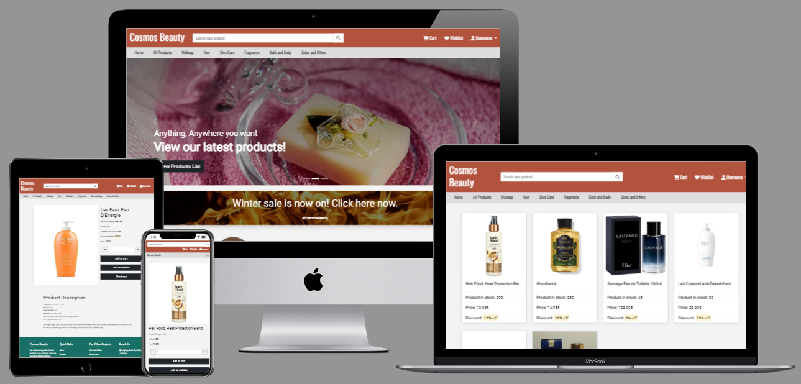

# Cosmos Beauty

Cosmos Beauty is ecommerce web app which is designed not only for cosmetics products but everything related to beauty. This app targets users who wants everything from makeup to bath and body products all in one place and hence easily buy them whenever they need to.

User can add products to their wishlist to buy them later. They can easily add/remove products as per their need even buy 10 items at the same time. Once order is placed user can also cancel order, remove items and even update the quantity of products.

The live site can be found here - [Cosmos Beauty](https://cosmos-beauty-133a3d7898aa.herokuapp.com/)

## Table of Contents

<small><i><a href='http://ecotrust-canada.github.io/markdown-toc/'>Table of contents generated with markdown-toc</a></i></small>
## User Experience (UX)

A visitor on Cosmos Beauty is most probably someone above age 15 who loves trying new beauty products or maybe buy the same product again or save it to buy later when there is discount going on that product.

### User Stories

#### User Profile
- As a Site User, I can signup to my account to place orders , update product quantities, cancel orders, remove items from my orders and add/remove products from wishlist.
- As a Site User, I can login to keep my account secure.
- As a Site User, I can keep my personal data such as my orders and wishlist to my self.
- As a Site User, I can login using my email as it's much easier than username.

#### User Navigation
- As a Site User, I can easily understand the purpose of the website by just one look and tell if it meets my expectations.
- As a Site User, I can search for products using search bar even after typing incomplete product names.
- As a Site User, I can navigate through the website without any struggle and find products I want.
- As a Site User, I can view paginated list of products on web page so that I can select only product I want with more ease.
- As a Site User, I can see the product detail by clicking the product.

#### Interaction with Product
- As a Site User, Once I select a product, I can add it to wishlist to buy it later.
- As a Site User, I can add/remove products from cart.
- As a Site User, I can read the details of the product.
- As a Site User, I can checkout once I add product to the cart.
- As a Site User, I can add maximum 10 items and minimum 1 item of same product.
- As a Site User, I can see if item is on discount or not.
- As a Site User, I can easily understand if a product id out of stock.

#### Cart Overview
- As a Site User, I can take an overview of the cart final time before moving to shipping.
- As a Site User, I can remove Items from cart.
- As a Site User, I can see my total of one product based on quantity and discount.
- As a Site User, I can see total of all products plus shipping cost before moving forward.

#### Shipping Details
- As a Site User, I can add my perosnal data inside shipping details if it does not exist.
- As a Site User, I can update my shipping details if they already exist.
- As a Site User, I can keep my personal data in app and can use it again without an updating it.

#### Order Complete
- As a Site User, I want to know when my order is going to reach me.
- As a Site User, I want option to view my placed order using My Order button or I can also use the nav bar for this purpose.
- As a Site User, I still have the option to see whats on sale or go to home page or see wishlist.
- As a Site User, I should always have the optio to place new orders after order completion.

#### My orders
- As a Site User, I can visit my orders to see all the orders placed by me.
- As a Site User, I can can cancel the orders whihc I have placed.
- As a Site User, I can update the quntity of the products inside my orders.
- As a Site User, I can remove an Item from multiple products list.

#### Wishlist
- As a Site User, I can add items to wishlist.
- As a Site User, I can view the products I have added to my wishlist once logged in.
- As a Site User, I can remove items from my wishlist once bought.

#### Sales and offers
- As a Site User, I can see easily which Items are on sale.
- As a Site User, I want to how much percent discount is there on products.
- As a Site User, Once I click the product I can see the updated discounted price of an item.

#### Product Categories
- As a Site User, If i want to see specific category of products I can easily navigate to it.

#### Search Products
- As a Site User, I can search for products based on it name.
- As a Site User, I can also serach for products which have specific charcters in them, for exapmple 'oo' should prind items conataing 'oo' in them.

#### User stories not yet implemented
The following Items were scoped out of the project which were initially part of the project but couldn't be implemented due to time constraint. These featured will be implemented on later date.

- As a Site User, I recieve 10% code on news letter subscription.
- As a Site User, I'll get free gift with every order I place.
- As a Site User, I'll not need to login at all to buy products.
- As a Site User, I can subscibe to weekly newsletter.
- As a Site User, I'll receieve order placed successfully email.

### Design

The design of this website is very simple considering the fact that users will come here to buy products so giving them things too facy will just end up annoying them. The fonts and the color scheme of website gives the user the sense of enthusiasm.

#### Colour Scheme
Colour palette is generated using [COOLORS](https://coolors.co/).

The color scheme of the website give a very good contrast after placing the main items of the web page and the main purpose of this color scheme is to give user the can do vibe to the user. The effect gives enthusiasm to the site users.

#### Imagery
Except the product images the remaining images are static.

#### Fonts
Following fonts are used on this web site.
- Roboto as main content on body.
- Ubuntu for all the buttons or hyperlinks acting as buttons.
- Oswald for nav and footer.

Sans-serif is acting as a backup font in case one of above mentioned fonts fail.

#### Wireframes

## Agile Methodology
Github Projects was used to manage the development process using agile approach. Kindly see link to project board [here](https://github.com/users/MBilalQureshi/projects/5/views/1).

The user stories seen above are based on the items completed mentioned on the project board.

## Data Model

## Testing

Testing and results can be found [here](/TESTING.md)

## Security Features and Defensive Design

### User Authentication

### Form Validation

### Database Security

## Features

### Header

### Footer

### Home Page

### User Account Pages

### Browse Products

### Products Detail

### Cart

### Shipment Detail

### Order Complete

### My orders

### Wishlist

## Libraries and Technologies Used
### Python Libraries

### Programs Used
- [GitHub](https://github.com/) used to host repository.
- [GitPod](https://gitpod.io/) used to develop project and organize version control.
- [Heroku](https://www.heroku.com/) used to deploy the live project.
- [PEP8 Online](https://pep8ci.herokuapp.com/#) used to validate all the Python code.

## Deployment
### Heroku
The site was deployed using Heroku and the live link can be found here: [Cosmos Beauty](https://cosmos-beauty-133a3d7898aa.herokuapp.com/).
1. Before actual deployment use "Heroku pip3 freeze > requirements.txt" on Gitpod console. This will add all the dependencies in requirements.txt file which will be needed by Heroku later during deployment.
2. Log in to [Heroku](https://www.heroku.com/).
3. On main page there is an option to create new app, click it.
4. Enter a unique application name and select your region.
5. Click on create app button.
6. Click settings and select Config Vars.
7. Click Reveal Config Vars and enter Key as "PORT" and Value as "8000" and press add button.
8. Input CREDS and the content of your Google Sheet API creds file as another config var and click add.
9. Scoll down on same page and add build packs, select "python" and click save.
10. Add another build pack "NodeJs" and click save.
11. Make sure python build pack is on top of NodeJs.
12. Go to top of page and select deploy option.
13. Select Github as deployment method.
14. Confirm to connect with github and auotherize Heroku from Github.
15. In search bar type repository name and click the connect button.
16. Scroll to the bottom of the deploy page and either click Enable Automatic Deploys for automatic deploys or Deploy Branch to deploy manually. Manually deployed branches will need re-deploying each time the repo is updated.
17. Click View to view the deployed site.

### Attach the Postgres database:

### Prepare the environment and settings.py file:

### Create files / directories

### Update Heroku Config Vars

### Deploy

### Forking the GitHub Repository
With Forking one can make a copy of a repository and to view or make changes in it without affecting the original repository. Following are the steps to do this.
1. Log in to GitHub and locate [Cosmos Beauty](https://github.com/MBilalQureshi/cosmos-beauty-pp4) repository.
2. At the top right side of the page just below the navigation bar, locate the fork button.
3. You will now have a copy of the repository.

### Making a Local Clone
1. Log in to GitHub and locate [Cosmos Beauty](https://github.com/MBilalQureshi/cosmos-beauty-pp4) repository.
2. Just below the repository name, click "Code".
3. There is an option to copy HTTPS link. Press copy icon.
5. Open Git Bash on local machine.
4. Change the current working directory to the location where we want the cloned directory to be made.
5. Type git clone on bash and paste the HTTPS URL we copied earlier.
6. Press Enter. local clone will be created.

## Credits
### Extra Help
- [Django](https://docs.djangoproject.com/en/4.2/) for understanding many concepts during project development.
- [Bootstrap](https://getbootstrap.com/docs/5.3/getting-started/introduction/) with multiple concepts in designing the website.
- [Allauth](https://docs.allauth.org/en/latest/introduction/index.html) for implementing it in our project.
- [Crispy forms](https://django-crispy-forms.readthedocs.io/en/latest/install.html) for implementing it in our project.
- [ChatGPT 3.5](https://chat.openai.com/) with following topics mentioned below.
- [Bootstrap Counter Field](https://www.codeply.com/go/2VmBU7TanF/bootstrap-plus-minus-counter-input) is taken from here. Its used in product details. An alternate handler of input where no form is used. Depricated JS code is removed from this code and updated as per need.
- [GeeksforGeeks](https://www.geeksforgeeks.org/python-extending-and-customizing-django-allauth/) for understanding the concept of making custom fields in allauth. In my case first and last name was added during sign up.
- [StackOverflow](https://stackoverflow.com/) with following topics mentioned below.
    - Fixing issue when [Email](https://stackoverflow.com/questions/27967319/django-allauth-email-login-always-wrong) was always considered invalid during login.
    - Fixing git error: failed to push some refs to remote from [here](https://stackoverflow.com/questions/24114676/git-error-failed-to-push-some-refs-to-remote)
    - Concept of [gt__](https://stackoverflow.com/questions/10040143/and-dont-work-with-filter-in-django) in query.
    - Concept of [~Q](https://stackoverflow.com/questions/60408935/django-model-query-with-not-equal-exclusion) to negate in query.
    - Concept of [value|floatformat:"0"](https://stackoverflow.com/questions/4831306/need-to-convert-a-string-to-int-in-a-django-template) to filter to float format.
    - Generating random invoice number as mentioned [here](
https://stackoverflow.com/questions/59147127/django-how-to-auto-generate-a-unique-number-string-for-a-model-attribute).
    - Reloading page on [AJAX](https://stackoverflow.com/questions/7881089/reload-the-page-after-ajax-success) success.
    - Concept of [login_required](https://stackoverflow.com/questions/6069070/how-to-use-permission-required-decorators-on-django-class-based-views) on class based views.
    - Setting user in form before submitting form as mentioned [here](https://stackoverflow.com/questions/46940623/how-to-do-i-automatically-set-the-user-field-to-current-user-in-django-modelform).
    - Using [flat=true](https://stackoverflow.com/questions/48606087/getting-values-of-queryset-in-django) in query.
    - Concept of Submit button out of form from [here](https://stackoverflow.com/questions/7020659/submit-form-using-a-button-outside-the-form-tag)

- [pexels](https://www.pexels.com/), following images mentined below.
    - [Image 1](https://www.pexels.com/photo/wood-planks-in-yellow-flames-18734673/)
    - [Image 2](https://images.pexels.com/photos/1926620/pexels-photo-1926620.jpeg) as if the image from database dosen't load.
    - [Image 3](https://www.pexels.com/photo/dhl-17840482/)
    - [Image 4](https://www.pexels.com/photo/businessman-fashion-man-person-8937582/)
    - [Image 5](https://www.pexels.com/photo/woman-in-a-hijab-using-a-laptop-and-a-smartphone-5206297/)
    - [Image 6](https://www.pexels.com/photo/smiling-man-in-a-gray-suit-standing-with-arms-crossed-by-a-fence-13801629/)
    - [Image 7]()
    - [Image 8]()
- Images and details for beauty products are taken from following website.
    - [flickr](https://www.flickr.com/photos/ookikioo/314692754)
    - [parfumdreams](https://en.parfumdreams.de/Anastasia-Beverly-Hills/Eyes/Eye-Shadow/Cosmos-Eyeshadow-Palette/index_123407.aspx)
    - [douglas](https://www.douglas.de/de/p/5010975033)
    - [douglas](https://www.douglas.de/de/p/3000000215?variant=708800)
    - [meine-parfuemer](https://www.meine-parfuemerie-lux.de/Pflege/Koerper-Damen/Koerperpflege/Biotherm-Lait-Corporel-Anti-Dessechant-pflegende-Bodylotion.html)
    - [douglas](https://www.douglas.de/de/p/3000027765)
    - [parfumdreams](https://www.parfumdreams.de/Biotherm/Duefte/Eau-dEnergie/Body-Lotion/index_10923.aspx?affid=Google-PLA_DE&gad_source=1&gclid=CjwKCAiAxreqBhAxEiwAfGfndH15_lt43vWxre_J7Eljn4NFBrfoQ6Rym1W6jC0tUL2SQW3OsC2DExoCjn0QAvD_BwE)
    - [douglas](https://www.douglas.de/de/p/3001016002?variant=876970&trac=DO_DE.01.01_Shopping.P_Shopping.Google.11406081296.114611656067.876970.online.PM&gad_source=1&gclid=CjwKCAiAxreqBhAxEiwAfGfndDkqn_tiM3EqmP50rF0DtUwKJocxZ8Szri09JhjcosPmR0rcy_PRGhoC_swQAvD_BwE)
    - [bathandbodyworks](https://www.bathandbodyworks.com/p/woodlands-3-in-1-hair-face-andamp-body-wash-026702554.html?cgid=body-care#start=2)
    - [iherb](
https://ca.iherb.com/pr/hair-food-heat-protection-blend-coconut-argan-oil-6-4-fl-oz-190-ml/114999?gad_source=1)
- [Nav bar](https://www.fundaofwebit.com/ecommerce-template/ecommerce-navbar-design-using-html-css-bootstrap) is taken from here and modified later as per need.
- [Footer](https://www.fundaofwebit.com/ecommerce-template/bootstrap-ecommerce-footer-template-in-html-css) is taken from here and modified later as per need.
- [hover.css](https://ianlunn.github.io/Hover/) is used to apply hover effect to buttons and hyperlinks.
- [Box Shadow](https://getcssscan.com/css-box-shadow-examples) for shadow effect.
- [Image zoom effect](https://w3bits.com/css-image-hover-zoom/) is taken from here.
- AJAX concept in django.
    - [Django](https://docs.djangoproject.com/en/3.2/ref/csrf/#ajax).
    - [Youtube](https://www.youtube.com/watch?v=kD2vWOZFFcw).
- Session from this [youtube](https://www.youtube.com/watch?v=UMKKQQcPH_A) video.
- [Nice Job](https://get.nicejob.com/resources/120-helpful-customer-service-quotes-from-the-pro) quotes.
- [CSS Fade-in Transition on Scroll](https://blog.hubspot.com/website/css-fade-in#text-transition) on home page.
### Acknowledgements
- My Mentor Antonio Rodriguez for helpful feedbacks during project development.
- Code Institute team for pointing in right direction.