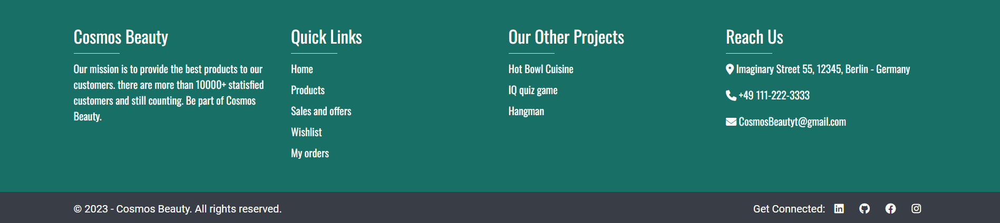

# Cosmos Beauty

Cosmos Beauty is an e-commerce web app that is designed not only for cosmetics products but everything related to beauty. This app targets users who want everything from makeup to bath and body products all in one place and hence easily buy them whenever they need to.

User can add products to their wishlist to buy them later. They can easily add/remove products as per their need even buy 10 items at the same time. Once an order is placed user can also cancel an order, remove items, and even update the quantity of products.

The live site can be found here - [Cosmos Beauty](https://cosmos-beauty-133a3d7898aa.herokuapp.com/)

## Table of Contents

- [Cosmos Beauty](#cosmos-beauty)
  * [Table of Contents](#table-of-contents)
  * [User Experience (UX)](#user-experience--ux-)
    + [User Stories](#user-stories)
      - [User Profile](#user-profile)
      - [User Navigation](#user-navigation)
      - [Interaction with Product](#interaction-with-product)
      - [Cart Overview](#cart-overview)
      - [Shipping Details](#shipping-details)
      - [Order Complete](#order-complete)
      - [My orders](#my-orders)
      - [Wishlist](#wishlist)
      - [Sales and offers](#sales-and-offers)
      - [Product Categories](#product-categories)
      - [Search Products](#search-products)
      - [User stories not yet implemented](#user-stories-not-yet-implemented)
    + [Design](#design)
      - [Colour Scheme](#colour-scheme)
      - [Imagery](#imagery)
      - [Fonts](#fonts)
      - [Wireframes](#wireframes)
  * [Agile Methodology](#agile-methodology)
  * [Data Model](#data-model)
  * [Testing](#testing)
  * [Security Features and Defensive Design](#security-features-and-defensive-design)
    + [User Authentication](#user-authentication)
    + [Form Validation](#form-validation)
    + [Database Security](#database-security)
    + [Custom error pages:](#custom-error-pages-)
  * [Features](#features)
    + [Header](#header)
      - [Logo](#logo)
      - [Search Bar](#search-bar)
      - [Top Navigation bar](#top-navigation-bar)
      - [Bottom Navigation bar](#bottom-navigation-bar)
    + [Footer](#footer)
      - [Top footer](#top-footer)
      - [Bottom Footer](#bottom-footer)
    + [Home Page](#home-page)
    + [User Account Pages](#user-account-pages)
      - [Sign Up](#sign-up)
      - [Sign in](#sign-in)
      - [Sign out](#sign-out)
    + [Browse Products](#browse-products)
    + [Products Detail](#products-detail)
    + [Cart](#cart)
    + [Shipment Detail](#shipment-detail)
    + [Order Complete](#order-complete-1)
    + [My orders](#my-orders-1)
    + [Wishlist](#wishlist-1)
    + [Error Pages](#error-pages)
  * [Libraries and Technologies Used](#libraries-and-technologies-used)
  * [Languages](#languages)
  * [Frameworks - Libraries - Programs Used](#frameworks---libraries---programs-used)
  * [Deployment](#deployment)
    + [Heroku](#heroku)
    + [Forking the GitHub Repository](#forking-the-github-repository)
    + [Making a Local Clone](#making-a-local-clone)
  * [Credits](#credits)
    + [Extra Help](#extra-help)
    + [Acknowledgements](#acknowledgements)

<small><i><a href='http://ecotrust-canada.github.io/markdown-toc/'>Table of contents generated with markdown-toc</a></i></small>

## User Experience (UX)

A visitor to Cosmos Beauty is most probably someone above age 15 who loves trying new beauty products or maybe buys the same product again or saves it to buy later when there is a discount going on that product.

### User Stories

#### User Profile
- As a Site User, I can sign up to my account to place orders, update product quantities, cancel orders, remove items from my orders, and add/remove products from my wishlist.
- As a Site User, I can log in to keep my account secure.
- As a Site User, I can keep my data such as my orders and wishlist to myself.
- As a Site User, I can log in using my email as it's much easier than a username.

#### User Navigation
- As a Site User, I can easily understand the purpose of the website with just one look and tell if it meets my expectations.
- As a Site User, I can search for products using the search bar even after typing incomplete product names.
- As a Site User, I can navigate through the website without any struggle and find the products I want.
- As a Site User, I can view a paginated list of products on the web page so that I can select only the products I want with more ease.
- As a Site User, I can see the product details by clicking the product.

#### Interaction with Product
- As a Site User, Once I select a product, I can add it to my wishlist to buy it later.
- As a Site User, I can add/remove products from the cart.
- As a Site User, I can read the details of the product.
- As a Site User, I can check once I add the product to the cart.
- As a Site User, I can add a maximum of 10 items and a minimum of 1 item of the same product.
- As a Site User, I can see if the item is on discount or not.
- As a Site User, I can easily understand if a product is out of stock.

#### Cart Overview
- As a Site User, I can take an overview of the cart final time before moving to shipping.
- As a Site User, I can remove items from the cart.
- As a Site User, I can see my total of one product based on quantity and discount.
- As a Site User, I can see the total of all products plus shipping cost before moving forward.

#### Shipping Details
- As a Site User, I can add my data inside shipping details if it does not exist.
- As a Site User, I can update my shipping details if they already exist.
- As a Site User, I can keep my data in the app and can use it again without updating it.

#### Order Complete
- As a Site User, I want to know when my order is going to reach me.
- As a Site User, I want the option to view my placed order using the My Order button or I can also use the nav bar for this purpose.
- As a Site User, I still have the option to see what's on sale go to the home page or see wishlist.
- As a Site User, I should always have the option to place new orders after order completion.

#### My orders
- As a Site User, I can visit my orders to see all the orders placed by me.
- As a Site User, I can cancel the orders that I have placed.
- As a Site User, I can update the quantity of the products inside my orders.
- As a Site User, I can remove an Item from multiple products list.

#### Wishlist
- As a Site User, I can add items to my wishlist.
- As a Site User, I can view the products I have added to my wishlist once logged in.
- As a Site User, I can remove items from my wishlist once bought.

#### Sales and offers
- As a Site User, I can see easily which Items are on sale.
- As a Site User, I want to how much percent discount is there on products.
- As a Site User, Once I click the product I can see the updated discounted price of an item.

#### Product Categories
- As a Site User, If I want to see a specific category of products I can easily navigate to it.

#### Search Products
- As a Site User, I can search for products based on their name.
- As a Site User, I can also search for products that have specific characters in them, for example, 'oo' should print items containing 'oo' in them.

#### User stories not yet implemented
The following items were scoped out of the project which was initially part of the project but couldn't be implemented due to time constraints. These features will be implemented at a later date.

- As a Site User, I receive a 10% code on a newsletter subscription.
- As a Site User, I'll get a gift with every order I place.
- As a Site User, I'll not need to log in at all to buy products.
- As a Site User, I can subscribe to a weekly newsletter.
- As a Site User, I'll receive an order placed successfully email.
- As a Site User, I'll have options to pay online rather than just COD(Cash on delivery).

### Design

The design of this website is very simple because users will come here to buy products so giving them things too facy will just end up annoying them. The fonts and the color scheme of the website give the user a sense of enthusiasm.

#### Colour Scheme
The color palette is generated using [COOLORS](https://coolors.co/).

The color scheme of the website gives a very good contrast after placing the main items on the web page and the main purpose of this color scheme is to give a can-do vibe to the user. The effect gives enthusiasm to the site users.

#### Imagery
Except for the product images, the remaining images are static.

#### Fonts
The following fonts are used on this website.
- Roboto as the main content on the body.
- Ubuntu for all the buttons or hyperlinks acting as buttons.
- Oswald for nav and footer.

Sans-serif is acting as a backup font in case one of the above-mentioned fonts fails.

#### Wireframes

Landing Page

Products and Wishlist Page

Product Detail Page

Cart Page

Shipping Details Page

Order Complete Page

My Orders Page

## Agile Methodology
GitHub Projects was used to manage the development process using the agile approach. Kindly see the link to the project board [here](https://github.com/users/MBilalQureshi/projects/5/views/1).

The user stories seen above are based on the items mentioned on the project board.

## Data Model
I used a session for cart items instead of storing it in the database and once the order is placed only then the data from the cart session is moved to the Confirmed Order Detail and User Bill model.

Cart Session contains the following items:
- Product id
- Product quantity
- Product price based on quantity
- Product discount
- Product total based on quantity

The wishlist contains the products the user wishes for and is stored inside the Wishes modal.

Products, their categories, and discounts on them are managed through Product, Product Categories, and Product Discount modals.

Before placing an order User shipment details are required which is managed in the Shipment Details modal.

The database schema is available below.

The database schema is designed using [Drawio](https://app.diagrams.net/).

## Testing

Testing and results can be found [here](/TESTING.md)

## Security Features and Defensive Design

### User Authentication
- Allauth is installed in the project for sign-in / signup and login. Users can only place orders once they are logged in.
- After certain points like once cart items are added or if the user clicks wishlist. he/she must log in before moving forward.
- Shipment details are only accessible to those users who have entered their credentials and logged in. If the user is new, the shipment detail form will be empty.
- No user can see other users' wishlists.
- Users' order data are also limited to them and them only.

### Form Validation
- Based on the data entered, every form in the project will be validated before moving forward. Characters will only take characters and integers just integers.
- The input field on the product details page is not part of the form as its value was only stored in the session, to handle the '-', '+', and input fields it required manual validation that can be seen on product details html, it's js content and CSS. See credits for more info. The deprecated code was removed and was updated as needed.
- The submit button will not work unless all the fields are filled with proper data and warning signs will also appear if data is not valid or fields are empty.
- CSRF (Cross-Site Request Forgery) tokens are used on all forms on the website.

### Database Security
The database URL and secret key are stored in the env file. This prevents unwanted connections to the database.

### Custom error pages:
Custom pages were made in case the user tries to enter invalid URLs or try to access forbidden pages. Custom pages were made for the following request.
- 400 Bad request
- 403 Page forbidden
- 404 Page not found
- 500 Server error 

Users are given options to redirect from these pages to valid ones in the form of buttons.

## Features

### Header

#### Logo
- The Cosmos Beauty logo is written on most right top of the header and it tells its-self what the website content going to be.
- Users can go to the home page by clicking it.

#### Search Bar
The search bar is used to search for products based on full name or keyword such as 'oo', this will fetch all products that contain 'oo' in them.

#### Top Navigation bar
This navigation bar contains the content related to the user. With it, users can see items in their wishlist, login/log out, and see cart items.

#### Bottom Navigation bar
This part of the navigation contains links to all products, category-based products, items on sale, and home.

### Footer

#### Top footer
This part of the footer has four parts as follows:
- The mission statement of Cosmos Beauty.
- Quick links to other parts of the website.
- Other projects (Not related to the website).
- Contact details and address.

#### Bottom Footer
This part of the footer has connection links and all rights reserved text.

### Home Page

Just below the header, there is a carousel. The main purpose of this is to provide a user with an experience like most modern e-commerce applications. 
- Users can click any one of three carousel footers for fast navigation.
- Users can swipe right or left to switch between screens or use the arrow buttons for this purpose.
- User can click buttons on carousel screens to redirect to the products page of their requirement.

- The sale banner is mostly here to announce about the active sale on the website.
- User can redirect to the sales page directly from here.

This section tells about the people of Cosmos Beauty and what they had to say about customer support.

### User Account Pages

#### Sign Up

#### Sign in

#### Sign out

- Django Allauth was installed and used for sign-in/ signup and signout.
- UI was designed later for a better user experience.
- Instaed of alerts, toasts will be seen when user perform any action on the website. From sign-in to cancelling orders.

### Browse Products

- This page will show the following based on which link the user had clicked. This method also enhances the user experience as well.
    - All Products links will show all the products available on the website.
    - Sales and offers will show only those products that are on sale.
    - Anything other than the above will show only the products based on their category.
    The search bar will show only those products that match the keyword or full product name. If nothing matches it'll say nothing matches related to this search.
    - Every page is paginated by max 8 products. If products are more than 8, it will be shown on the next page.
    - The products list will contain the following information per product
        - Product image
        - Product name
        - Original price
        - Discount percentage (If on sale)
        - Number of items in stock

### Products Detail

- The user is given multiple options along with product description so that the user knows what they are buying and does it fulfill their need.
- Users had the option to add items to the wishlist so they could come back later and log in again to buy products from the wishlist.
- User can set quantity of items before buying. A maximum of 10 items of the same product can be bought at the same time.
- User can add/remove a product from the cart.
- The product will show the following information as well
    - Product image
    - Product name
    - Original price
    - Discounted price (If on sale)
    - Number of items in stock
    - Product Category

### Cart

The cart will contain all the items that the user wants to buy.
- The cart will contain the following information per item
    - Product image
    - Product name
    - Original price
    - Sale price, in case not on sale it will show €0.0.
    - Product price total based on quantity.
- The user is also given the option to remove the product from the cart.
- In the end, the total of all products, plus shipping cost and overall total is shown to the user.
- On continue user will be redirected to the sign-in page, if not signed in. Once the user is signed in. The user is redirected to Shipping Details.

### Shipment Detail

The shipping details will contain a form for the user to enter his/her shipping information. There are three situations here in which the user can act.
1. The form is empty user had to fill in all the fields before placing an order.
2. User information already exists he/she just had to confirm information before placing an order.
3. The user can update the information already available and place an order once new data is entered.

**NOTE 1** Stripe is currently not integrated into the project so only the COD(Cash on Delivery) option is given in the method field. 
**NOTE 2** **Create, Read and Update** can be done on this page.

### Order Complete

- On order completion user is congratulated on placing the order.
- The user is given a warning to keep the payment ready once the DHL courier arrives.
- Duration of when the package will arrive.
- Options to what to do next once an order is placed in the form of buttons.

**NOTE** At this point cart session is cleared, so if the user goes back to the shipping details page and clicks "Finish Order", he/she is redirected to "my orders page" as the order was already placed. Now order lists are **created** inside the database.

### My orders

- Here list of all the orders placed by the user is shown.
- Every order contains the following information:
    - Invoice number
    - Product Image
    - Product name
    - Quantity of items, that can be updated.
    - Total of the product
    - Option to remove items from the products list.
    - Finally, an option to cancel the order. A modal to cancel an order will appear to ask the user if he/she is sure to cancel the order.
    - If there is only one product and the user clicks remove, the cancel order modal will appear instead of just removing one item. Removing an only item is equal to canceling the order.

**NOTE** In real-world applications, there is no such thing as updating quantity once an order is placed as per my understanding, updating quantity has therefore no effect on actual stocks inside the Products table. Every action on this page has an impact only on Confirmed order details and User Bill modals. The purpose of this page is only to show **Read, Update, and delete**. I intend to disable the 'update', and 'remove' options in the future and give the user the option to cancel orders only via E-mail.

### Wishlist

- Wishlist contains the items of the user which he/she added to the wishlist.
- These items can only be viewed once the user is logged in.
- These items will remain here unless the user removes them.

### Error Pages

There are four custom pages to handle, the following request
1. 400 Bad Request
2. 403 Page forbidden
3. 404 Page not found
4. 500 Server Error

These pages have the same pattern except text and their main purpose is to give the user a better experience on the website.

## Libraries and Technologies Used
## Languages

- Python
- HTML
- CSS
- Javascript

## Frameworks - Libraries - Programs Used
- [GitHub](https://github.com/) is used to host the repository and agile tool.
- [GitPod](https://gitpod.io/) is used to develop project and organize version control.
- [Heroku](https://www.heroku.com/) used to deploy the live project.
- [PEP8 Online](https://pep8ci.herokuapp.com/#) used to validate all the Python code.
- [Google Fonts](https://fonts.google.com/) is used to change the fonts of the project.
- [W3C](https://www.w3.org/) - Used for HTML & CSS Validation.
- [Jshint](https://jshint.com/) - used to validate javascript.
- [Django](https://www.djangoproject.com/) framework is used for the development of this project.
- [Django-allauth](https://django-allauth.readthedocs.io/en/latest/installation.html) is the authentication library used to create the user accounts.
- [Crispy Forms](https://django-crispy-forms.readthedocs.io/en/latest/) used to manage Django Forms.
- [Cloudinary](https://cloudinary.com/) is used as an image hosting service. Product images are uploaded there.
- [PostgreSQL](https://www.postgresql.org/) is used as the database for this project.
- [Bootstrap 5](https://getbootstrap.com/docs/4.6/getting-started/introduction/): is a CSS framwork and is used for styling in project.
- [Summernote](https://summernote.org/) editor is mainly used when adding product details on the admin panel which is to be later seen on the product details page.
- [Balsamiq](https://balsamiq.com/) is used to generate wireframe images for this project.
- [Techsini](https://techsini.com/multi-mockup/index.php) is used for generating site mockup.
- [Coolors](https://coolors.co/) is used to create a color palette.
- [Drawio](https://app.diagrams.net/) is used to make database schema.
- [Favicon](https://favicon.io/) is used to create the favicon.
- [Responsinator](http://www.responsinator.com/) is used to verify the responsiveness of the website on different devices.
- [Chrome Dev Tools](https://developer.chrome.com/docs/devtools/) is used for overall development and bug locating/fixing, including testing responsiveness, performance, and confirming the webpage's accessibility using lighthouse.
- [Font Awesome](https://fontawesome.com/) is used for icons used all over the project.
- [Grammerly](https://app.grammarly.com/) is used to proofread the README.md and testing.md.
- [Gunicorn](https://gunicorn.org/) is a Python WSGI HTTP Server for our project.
- [freeformatter](https://www.freeformatter.com/) is used to format html.

## Deployment
### Heroku
The site was deployed using Heroku and the live site can be found here: [Cosmos Beauty](https://cosmos-beauty-133a3d7898aa.herokuapp.com/).
Note: Make sure to set DEBUG to False before deployment.
1. Before actual deployment use "Heroku pip3 freeze > requirements.txt" on the Gitpod console. This will add all the dependencies in the requirements.txt file which will be needed by Heroku later during deployment.
2. Log in to [Heroku](https://www.heroku.com/).
3. On the main page there is an option to create a new app, click it.
4. Enter a unique application name and select your region.
5. Click on the Create App button.
6. Click settings and select Config Vars.
7. Click Reveal Config Vars enter the Key as "PORT" and Value as "8000" and press the add button.
8. Add CLOUDINARY_URL as another config var and click add.
9. Next add Postgres DATABASE_URL and click add.
10. After that add Django project SECRET_KEY.
12. Same way Set DISABLE_COLLECTSTATIC to 1 and click add.
13. Go to the top of the page and select the deploy option.
14. Select Github as the deployment method.
15. Confirm to connect with GitHub and authorize Heroku from Github.
16. In the search bar type the repository name and click the connect button.
17. Scroll to the bottom of the deploy page and either click Enable Automatic Deploys for automatic deploys or Deploy Branch to deploy manually. Manually deployed branches will need re-deploying each time the repo is updated.
17. Click View to view the deployed site.

### Forking the GitHub Repository
With Forking one can make a copy of a repository and view or make changes in it without affecting the original repository. Following are the steps to do this.
1. Log in to GitHub and locate [Cosmos Beauty](https://github.com/MBilalQureshi/cosmos-beauty-pp4) repository.
2. At the top right side of the page just below the navigation bar, locate the fork button.
3. You will now have a copy of the repository.

### Making a Local Clone
1. Log in to GitHub and locate [Cosmos Beauty](https://github.com/MBilalQureshi/cosmos-beauty-pp4) repository.
2. Just below the repository name, click "Code".
3. There is an option to copy the HTTPS link. Press the copy icon.
5. Open Git Bash on the local machine.
4. Change the current working directory to the location where we want the cloned directory to be made.
5. Type git clone on bash and paste the HTTPS URL we copied earlier.
6. Press Enter. local clone will be created.

## Credits
### Extra Help
- [Django](https://docs.djangoproject.com/en/4.2/) for understanding many concepts during project development.
- [Bootstrap](https://getbootstrap.com/docs/5.3/getting-started/introduction/) with multiple concepts in designing the website.
- [Allauth](https://docs.allauth.org/en/latest/introduction/index.html) for implementing it in our project.
- [Crispy forms](https://django-crispy-forms.readthedocs.io/en/latest/install.html) for implementing it in our project and its other topics for handling forms.py to modify forms inside shipping detail.
- [ChatGPT 3.5](https://chat.openai.com/) helped me with fixing a few issues, kindly see bugs and issues topics in testing.md file.
- [Bootstrap Counter Field](https://www.codeply.com/go/2VmBU7TanF/bootstrap-plus-minus-counter-input) is taken from here. It's used in product details. An alternate handler of input where no form is used. The deprecated JS code is removed from this code and updated as needed.
- This geeks for geeks [link](https://www.geeksforgeeks.org/python-extending-and-customizing-django-allauth/) for understanding the concept of making custom fields in allauth. In my case first and last name was added during sign-up.
- [StackOverflow](https://stackoverflow.com/) with following topics mentioned below.
  

  
Stackoverflow links

    - Fixing issue when [Email](https://stackoverflow.com/questions/27967319/django-allauth-email-login-always-wrong) was always considered invalid during login.
    - Fixing git error: failed to push some refs to remote from [here](https://stackoverflow.com/questions/24114676/git-error-failed-to-push-some-refs-to-remote).
    - Concept of [gt__](https://stackoverflow.com/questions/10040143/and-dont-work-with-filter-in-django) in query.
    - Concept of [~Q](https://stackoverflow.com/questions/60408935/django-model-query-with-not-equal-exclusion) to negate in query.
    - Concept of [value|floatformat:"0"](https://stackoverflow.com/questions/4831306/need-to-convert-a-string-to-int-in-a-django-template) to filter to float format.
    - Generating random invoice numbers as mentioned [here](
  https://stackoverflow.com/questions/59147127/django-how-to-auto-generate-a-unique-number-string-for-a-model-attribute).
    - Reloading page on [AJAX](https://stackoverflow.com/questions/7881089/reload-the-page-after-ajax-success) success.
    - Concept of [login_required](https://stackoverflow.com/questions/6069070/how-to-use-permission-required-decorators-on-django-class-based-views) on class based views.
    - Setting user in the form before submitting the form as mentioned [here](https://stackoverflow.com/questions/46940623/how-to-do-i-automatically-set-the-user-field-to-current-user-in-django-modelform).
    - Using [flat=true](https://stackoverflow.com/questions/48606087/getting-values-of-queryset-in-django) in query.
    - Concept of Submit button out of form from [here](https://stackoverflow.com/questions/7020659/submit-form-using-a-button-outside-the-form-tag)
    - [Page relaod](https://stackoverflow.com/questions/43043113/how-to-force-reloading-a-page-when-using-browser-back-button) for product details page when user clicks back button.
  

- [pexels](https://www.pexels.com/), following images mentioned below.
  

  
Images List by pexels

  - [Image 1](https://www.pexels.com/photo/wood-planks-in-yellow-flames-18734673/)
  - [Image 2](https://images.pexels.com/photos/1926620/pexels-photo-1926620.jpeg). This will be displayed in case the image from the Cloudinary database doesn't work.
  - [Image 3](https://www.pexels.com/photo/dhl-17840482/)
  - [Image 4](https://www.pexels.com/photo/businessman-fashion-man-person-8937582/)
  - [Image 5](https://www.pexels.com/photo/woman-in-a-hijab-using-a-laptop-and-a-smartphone-5206297/)
  - [Image 6](https://www.pexels.com/photo/smiling-man-in-a-gray-suit-standing-with-arms-crossed-by-a-fence-13801629/)
  - [Image 7](https://www.pexels.com/photo/assorted-cosmetic-lot-2536965/)
  - [Image 8]()

  

- Images and details for beauty products are taken from the following website.
  

  
Products Images and description

  - [flickr](https://www.flickr.com/photos/ookikioo/314692754)
  - [parfumdreams](https://en.parfumdreams.de/Anastasia-Beverly-Hills/Eyes/Eye-Shadow/Cosmos-Eyeshadow-Palette/index_123407.aspx)
  - [douglas](https://www.douglas.de/de/p/5010975033)
  - [douglas](https://www.douglas.de/de/p/3000000215?variant=708800)
  - [meine-parfuemer](https://www.meine-parfuemerie-lux.de/Pflege/Koerper-Damen/Koerperpflege/Biotherm-Lait-Corporel-Anti-Dessechant-pflegende-Bodylotion.html)
  - [douglas](https://www.douglas.de/de/p/3000027765)
  - [parfumdreams](https://www.parfumdreams.de/Biotherm/Duefte/Eau-dEnergie/Body-Lotion/index_10923.aspx?affid=Google-PLA_DE&gad_source=1&gclid=CjwKCAiAxreqBhAxEiwAfGfndH15_lt43vWxre_J7Eljn4NFBrfoQ6Rym1W6jC0tUL2SQW3OsC2DExoCjn0QAvD_BwE)
  - [douglas](https://www.douglas.de/de/p/3001016002?variant=876970&trac=DO_DE.01.01_Shopping.P_Shopping.Google.11406081296.114611656067.876970.online.PM&gad_source=1&gclid=CjwKCAiAxreqBhAxEiwAfGfndDkqn_tiM3EqmP50rF0DtUwKJocxZ8Szri09JhjcosPmR0rcy_PRGhoC_swQAvD_BwE)
  - [bathandbodyworks](https://www.bathandbodyworks.com/p/woodlands-3-in-1-hair-face-andamp-body-wash-026702554.html?cgid=body-care#start=2)
  - [iherb](https://ca.iherb.com/pr/hair-food-heat-protection-blend-coconut-argan-oil-6-4-fl-oz-190-ml/114999?gad_source=1)
  - [douglas](https://www.douglas.de/de/p/3000039681)
  - [fnf](https://fnf.co.ke/product/creed-aventus-eau-de-parfum-100ml/)
  - [douglas](https://www.douglas.de/de/p/3001044085?variant=455949)
  - [avsfreeov](https://avsfreeov.life/product_details/81478479.html)
  - [douglas](https://www.douglas.de/de/p/5003621296?variant=1049874)
  - [lookfantastic](https://www.lookfantastic.com/wella-professionals-care-fusion-intense-repair-shampoo-1000ml/11870437.html?affil=thggpsad&switchcurrency=GBP&shippingcountry=GB&affil=thgppc&kwds=&thg_ppc_campaign=71700000114615795&adtype=pla&product_id=11870437&gclid=Cj0KCQiAyKurBhD5ARIsALamXaGn6ZFKaaFsBYxjkB7k4lDyH_cCpkBZBjz_Kw_YeyMB5AnMsiiMxPwaAvhIEALw_wcB&gclsrc=aw.ds)
  - [lookfantastic](https://www.lookfantastic.com/cerave-cleanse-the-day-away-duo/12033179.html)
  - [beautyline](https://beautyline.com.cy/product-details/cosmos-eyeshadow-palettehttps://beautyline.com.cy/product-details/cosmos-eyeshadow-palette)
  - [kastner-oehler](https://www.kastner-oehler.de/estee-lauder-double-wear-stay-in-place-liquid-make-up-spf10-30ml-17-bone-beige-6946490.html)
  
  

- [Nav bar](https://www.fundaofwebit.com/ecommerce-template/ecommerce-navbar-design-using-html-css-bootstrap) is taken from here and modified later as needed.
- [Footer](https://www.fundaofwebit.com/ecommerce-template/bootstrap-ecommerce-footer-template-in-html-css) is taken from here and modified later as needed.
- [hover.css](https://ianlunn.github.io/Hover/) is used to apply the hover effect to buttons and hyperlinks.
- [Box Shadow](https://getcssscan.com/css-box-shadow-examples) for shadow effect.
- [Image zoom effect](https://w3bits.com/css-image-hover-zoom/) is taken from here.
- AJAX concept in Django.
    - [Django](https://docs.djangoproject.com/en/3.2/ref/csrf/#ajax).
    - [Youtube](https://www.youtube.com/watch?v=kD2vWOZFFcw).
- Session from this [YouTube](https://www.youtube.com/watch?v=UMKKQQcPH_A) video.
- [Nice Job](https://get.nicejob.com/resources/120-helpful-customer-service-quotes-from-the-pro) quotes.
### Acknowledgements
- My Mentor Antonio Rodriguez for helpful feedback during project development.
- Code Institute team for pointing in the right direction.