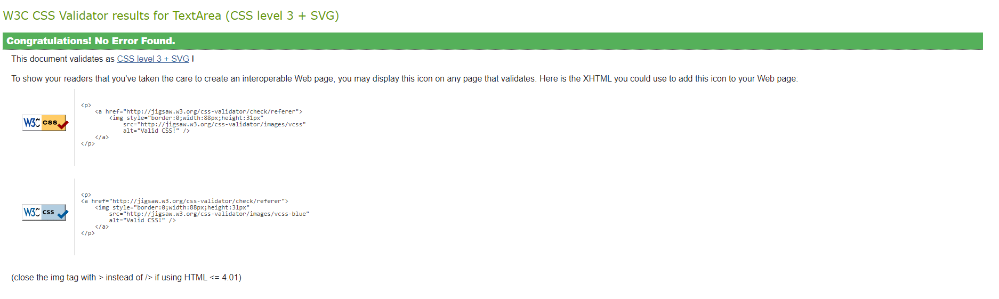
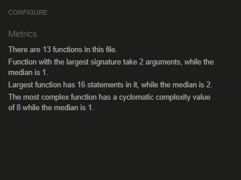

# Testing

## Table of Contents

- [Testing](#testing)
  * [Table of Contents](#table-of-contents)
  * [Validator Testing](#validator-testing)
    + [HTML](#html)
      - [Note 1](#note-1)
      - [Note 2](#note-2)
      - [General Information](#general-information)
    + [CSS](#css)
    + [Javascript](#javascript)
    + [Python](#python)
    + [Lighthouse](#lighthouse)
  * [Browser Testing](#browser-testing)
  * [Device Testing](#device-testing)
- [Manual Testing](#manual-testing)
  * [Home](#home)
  * [All Products](#all-products)
  * [Product with category](#product-with-category)
  * [Sales and offers](#sales-and-offers)
  * [Product Detail](#product-detail)
  * [Cart](#cart)
  * [Shipping Details](#shipping-details)
  * [Order Complete](#order-complete)
  * [My Orders](#my-orders)
  * [Wishlist](#wishlist)
- [Bugs and Issues](#bugs-and-issues)
  * [Content Overflow](#content-overflow)
  * [Buttons Merging](#buttons-merging)
  * [Login with email always wrong](#login-with-email-always-wrong)
  * [Zipping variable to loop together](#zipping-variable-to-loop-together)
  * [Allauth, Custom fields](#allauth--custom-fields)
  * [Gitpush head error](#gitpush-head-error)
  * [Negate and minus/plus inside query](#negate-and-minus-plus-inside-query)
  * [Out-of-stock products not appearing](#out-of-stock-products-not-appearing)
  * [Products categories redundancy](#products-categories-redundancy)
  * [Search bar bug](#search-bar-bug)
  * [The footer sticking to the bottom](#the-footer-sticking-to-the-bottom)
  * [Team images on home page text confusion](#team-images-on-home-page-text-confusion)
  * [Cart data storage](#cart-data-storage)
  * [Quantity input product details page](#quantity-input-product-details-page)
  * [My orders total](#my-orders-total)
  * [Unfixed bugs](#unfixed-bugs)

<small><i><a href='http://ecotrust-canada.github.io/markdown-toc/'>Table of contents generated with markdown-toc</a></i></small>

## Validator Testing

### HTML

Every page is run through [W3C HTML Validator](https://validator.w3.org/). The results are mentioned below.

| Page                 | Logged in     | Logged out     | Notes  |
|----------------------|---------------|----------------|--------|
| base.html            | N/A           | N/A            |        |
| index.html           | No errors     | No errors      |        |
| products.html        | No Errors     | No Errors      |        |
| product_detail.html  | No Errors     | No Errors      | Note 1 |
| cart.html            | No Errors     | No Errors      |        |
| user_checkout.html   | No Errors     | No Errors      | Note 2 |
| order_complete.html  | No Errors     | No Errors      |        |
| my_orders.html       | No Errors     | No Errors      |        |
| wishlist.html        | No Errors     | No Errors      |        |
| paginator.html       | No Errors     | No Errors      |        |
| login.html           | No Errors     | No Errors      |        |
| logout.html          | No Errors     | No Errors      |        |
| signup.html          | No Errors     | No Errors      |        |
| 400.html             | No Errors     | No Errors      |        |
| 403.html             | No Errors     | No Errors      |        |
| 404.html             | No Errors     | No Errors      |        |
| 500.html             | No Errors     | No Errors      |        |


#### Note 1
The errors shown here are actually how Summernote works. Nothing can be done about this.

#### Note 2
The placeholder error is not an error but an implementation inside the forms.py file for placing placeholders on Shipment detail fields using crispy forms.

#### General Information
The content inside the main tags is only tested to avoid the errors generated by the scripts.

### CSS
[W3C CSS Validator](https://jigsaw.w3.org/css-validator/) found no error in the CSS file.
 <details>

 <summary>W3C CSS Validator result</summary>


 </details>

 ### Javascript
[Jshint](https://jshint.com/) found no errors in the JS file.

<details>

<summary>Jshint Result</summary>


</details>

### Python
No errors were found when running Python files through [Pep8](https://pep8ci.herokuapp.com/#).

### Lighthouse
| Page            | Performance  | Accessibility | Best Practices  | SEO |
|-----------------|:------------:|:-------------:|:---------------:|:---:|
|                 |              |               |                 |     |
| Desktop         |              |               |                 |     |
| Home            |           92 |           100 |             100 | 100 |
| Products        |           93 |           100 |             100 | 100 |
| Product Details |           92 |           100 |             100 | 100 |
| Cart            |           93 |           100 |             100 | 100 |
| Shipping detail |           90 |           100 |             100 | 100 |
| Wishlist        |           93 |           100 |             100 | 100 |
| My orders       |           90 |           100 |             100 | 100 |
| Signin          |           93 |           100 |             100 | 100 |
| Signout         |           95 |           100 |             100 | 100 |
| Signup          |           90 |           100 |             100 | 100 |
|                 |              |               |                 |     |
| Mobile          |              |               |                 |     |
| Home            |           80 |           100 |             100 | 100 |
| Products        |           81 |           100 |             100 | 100 |
| Product Details |           85 |           100 |             100 | 100 |
| Cart            |           84 |           100 |             100 | 100 |
| Shipping detail |           83 |           100 |             100 | 100 |
| Wishlist        |           85 |           100 |             100 | 100 |
| My orders       |           80 |           100 |             100 | 100 |
| Signin          |           83 |           100 |             100 | 100 |
| Signout         |           86 |           100 |             100 | 100 |
| Signup          |           85 |           100 |             100 | 100 |

## Browser Testing
- The Website was tested on Firefox, Google Chrome, and Safari browsers with no issues noted.
- Firefox bug fix: All three buttons on product details were attached with no margin between them, this was caused by br tags used after buttons. br tags were removed and content was moved inside divs with proper margins on top and bottoms.

## Device Testing
The Cosmos Beauty is tested across various devices provided by Chrome devtool. Some of the devices are Galaxy S3, Microsoft Lumia 950, Kindle Fre HDX, Nexus 7, Galaxy S8, iPhone SE, iPhone XR, iPhone 12, iPhone 5, iPhone 12 pro-Max, Jiophone 2(smallest screen size), Surface Duo, Ipad Air, Galaxy Fold and Nest Hub.
 - On Jiophone 2, the h1 tag text was overflowed. This was fixed by removing the unnecessary class Display-4 from the h1 tag.

# Manual Testing
## Home
- I confirmed logo acts as a redirect link to the home page.
- I confirmed all the links on the nav bar are clickable and redirect the user to their related page i.e. login, logout, product categories, wishlist, sales, and offers.
- I confirmed search bar works effectively even on keywords such as 'oo'.
- I confirmed user can select products based on category and it will show only those products based on that category.
- I confirmed buttons on the carousel are clickable.
- I confirmed user can swipe images right or left on the carousel, and the content will also change.
- I confirmed sales banner on the home page is clickable and redirects to the sales page.
- I confirmed the page is responsive as per different screen sizes
- I confirmed the links on the footer open on a new tab.

## All Products 
- I confirmed all the products here are clickable and redirected the user to the product details page
- I confirmed all the product categories and items on sale are visible here.
- I confirmed products will also display relevant information such as image, name, and price.

## Product with category
- I confirmed only specific categories of products will be displayed here such as makeup or fragrances.
- The items on sale are also visible but belong only to that specific category.
- I confirmed products will also display relevant information such as image, name, and price.

## Sales and offers
- I confirmed that the items on sale are only displayed here.
- I confirmed all the category items can be seen here.
- I confirmed products will also display relevant information such as image, name, and price.

## Product Detail
- I confirmed user can add/remove items from the cart while on the product details page.
- I confirmed user can add products to the wishlist from here.
- I confirmed user can checkout meaning redirect to the cart page from this page.
- I confirmed user can view details of the product along with its description.

## Cart
- I confirmed user can remove items from the cart.
- I confirmed user can view relevant details of the product from the cart.
- I confirmed user can view the total from inside the card.
- I confirmed user can go to shipping details from the cart.

## Shipping Details
- I confirmed the fields will be empty for every new user.
- I confirmed All the fields here are editable except the Method dropdown which is set to COD.
- I confirmed user can update the shipment data each time he/she places an order.
- I confirmed that the fields can't be set empty.
- I confirmed the button here completes the order process.

## Order Complete
- I confirmed user can see that the order was placed successfully.
- I confirmed the user is shown the time duration when he/she will get the order.
- I confirmed if the user goes back to shipping and clicks finish order, the user will be redirected to my orders as the order is already placed.
- I confirmed user is given clickable options to redirect from this page.

## My Orders
- I confirmed user can see all the orders he/she had placed from my orders.
- I confirm user can update the quantity while being on my orders.
- I confirmed user can cancel complete orders from here.
- I confirmed user can remove items from my orders list
- I confirmed the user is given a cancel order option if only one product exists in an order.

## Wishlist
- I confirmed that only items the user had added to the wishlist are displayed here.
- I confirmed products will also display relevant information such as image, name, and price.

# Bugs and Issues

## Content Overflow

On the smallest screen size on the order complete page, the content inside the h1 tag was overflowed from its container.

**Fix:** This was fixed by removing unnecessary class Display-4 from h1 tag.

## Buttons Merging

On Firefox, all three buttons on product details were attached with no margin between them.

**Fix:** This was caused by br tags used after buttons. br tags were removed and content was moved inside divs with proper margins on top and bottoms.

## Login with email always wrong

The email login was always considered wrong.

**Fix:** After setting ACCOUNT_AUTHENTICATION_METHOD = 'email', I needed to set this as well inside setting.py

```css
    AUTHENTICATION_BACKENDS = (
    "django.contrib.auth.backends.ModelBackend",
    "allauth.account.auth_backends.AuthenticationBackend"
    )
```

## Zipping variable to loop together

I had a situation at my orders view where I had to loop through one list and dict at the same time I used multiple ways to achieve this but was not able to do this including zipping the variables together. This was needed as one order could have multiple products, and one order could have only one product.
This was the code that I wrote initially 
```
def get(self, request):
        get_products ={}
        form = []
        if request.user.is_authenticated:
            get_invoice_list = UserBill.objects.filter(user_info=request.user).values_list('user_unique_order_no',flat = True)           
            if get_invoice_list:
                for invoice_number in get_invoice_list:
                    get_products[invoice_number] = ConfirmedOrderDetail.objects.filter(user_unique_order_no = invoice_number).values_list('product_info','product_info__image','product_info__name','quantity','prod_total', 'product_info__stock',)
                        # print(x[0])
                        instance = get_object_or_404(ConfirmedOrderDetail,user_unique_order_no = invoice_number,product_info = x[0])
                        form.append(ConfirmedOrderDetailForm(instance = instance)) 
            else:
                print("No invoices available")         
        return render(
            request,
            "my_orders.html",
            {
                'form':form,
                'get_products':get_products,
            },
        )
```

And inside HTML

```

    
     
    

```
I tried the following options to zip my data

1. The zipped data always gives errors and was not able to loop through the data on html side.

```
def view(request):
    #code
    my_list = ['a', 'b', 'c']
    my_dict = {'a': '1', 'b': '2', 'c': '3'}
    my_zipped_data = list(zip(my_list, my_dict.keys(), my_dict.values()))
    return render(request, 'my_orders.html', {'zipped_data': zipped_data})
    #code
```

and inside HTML
```

    {{ list_item }}: {{ key }} - {{ value }}

```

2. However as told on Stackoverflow, I was not able to use |zip:my_dict.items.

```
def view(request):
    #code
    my_list = ['a', 'b', 'c']
    my_dict = {'a': '1', 'b': '2', 'c': '3'}
    my_zipped_data = list(zip(my_list, my_dict.keys(), my_dict.values()))
    return render(request, 'my_orders.html', {'my_list': my_list, 'my_dict': my_dict})
    #code
```
and inside HTML
```

    {{ list_item }}: {{ key }} , {{ value }}

```
**Fix:** ChatGpt solution

inside View, I had to add this code to merge dict and list together inside view and set get_products and form_instances.
```
form_instances_for_invoice = []  # Store form instances for each invoice
for product_data in products_data:
    instance = get_object_or_404(ConfirmedOrderDetail, user_unique_order_no=invoice_number, product_info=product_data[0])
    form = ConfirmedOrderDetailForm(instance=instance)
    form_instances_for_invoice.append(form)

# Store product data and form instances in the dictionary
get_products[invoice_number] = {
    'product_info': products_data,
    'form_instances': form_instances_for_invoice,
}

# Extend the list of all form instances
form_instances.extend(form_instances_for_invoice)
```
inside HTML
```

    
    - 
    

```

## Allauth, Custom fields

Initially, the plan was to ask user for first and last name but all auth didn't provide any field for that. as per discusion with CI tutor I had to make a custom field.

**Fix:** I added custom First and last name by adding

```
first_name = forms.CharField(
    max_length=16,
    label='First Name',
    widget=forms.TextInput(attrs={'placeholder': 'First Name'})
)
```
And in same way last name.

However, its purpose was to ask the user first and last name, so that it didn't had to do it in shipment details. But this can to my attention later that First and last name are also required during shipping as the person whom the items are being shipped to name could be different than account holder. I'll give check box option in future to ask user to use same first and last name as account during shipping.

## Gitpush head error

There was this git error: failed to push some refs to remote. It was caused when I added a template for issues in the project. This caused adding this to git with a commit. Back on my project, it was always one step behind than last commit.

This cost me one time lost of my actual work on the project due to an invalid commit I did on gitpod.

**Fix:** There was actaullay a simple solution to this which is 

```
git pull --rebase
git push
```

## Negate and minus/plus inside query

There was sitaiation when I had to negate and minus from total inside query.

**Fix:** This could be easily done ~Q for negating and ~F for minus plus operations inside the query.

## Out-of-stock products not appearing

The products that were out of stock not appear on the page, instead I was getting a 404 page not found.

**Fix:** The issue was that the I accidently applied stock__gt=0 on multiple views which caused this. I just removed its filter and out-of-stock products started appearing.

## Products categories redundancy

Initially, I had multiple URLs and view for all the products and categories which looked really redundent and I talked about this with my Mentor **Antonio Rodriguez**.

**Fix:** My mentor taught me the way where I can remove this redundancy and fixed this code.

- The redundent url of product categories were removed.
- menu_products.html was created for looping through categories.
- Above html file added to base.html.
- Add menuproducts.py file inside template tags.
- Finally update ProductsCategory view and remove redundent category views.

## Search bar bug

The search was only working for keywords like 'oo' but if I wrote 'Hair food', it found no result for it.

**Fix:** Inside the view for searching instead of contain, by using icontain fixed this bug.

## The footer sticking to the bottom

The footer was not sticking to bottom so I used Bootstrap class for it to stick to the bottom but unfortunately, It only sticks till the main content size. Meaning the space after the footer was still blank.

**Fix:** I asked chatgpt, and it gave the simple solution which is:

```
body{
    display: flex;
    flex-direction: column;
    min-height: 100vh;
}
main{
    flex: 1;
}
```
This always pushed the footer without breaking the main content.

## Team images on home page text confusion

As per discussion with my Mentor, the images are too far from their text and give the impression that the person below is saying those quotes.

**Fix:** I updated the bootstrap classes moved the images closest to their relevant text for larger screens and gave proper margins below them to avoid this confusion.

## Cart data storage

Initially, I wanted to store the cart data inside the database, but as I progressed through the project it seemed very impractical to go to DB again and again for product removal and addition.

**Fix:** After some R&D, it was obvious that the cart data should only be stored in session and once the order is placed its data should be moved to the database.

## Quantity input product details page

The quantity handler here is not part of form so I had to manage the quantity input and + - signs my self using JS but it turns out very tricky. I had lot of bugs handling it.

**Fix:** I found already built-in code for this mentioned in credits as well, I just had to make some changes to fix the deprecated code and I was able to make it work to handle the quantity and store it in session.

## My orders total

The total was not updating at all even if the quantity is updated.

**Fix:** The total was not handled and I saw it during the testing and fixed my orders post view so that it could be seen on the page.

## Unfixed bugs
- No known unfixed bugs.

Return back to the [README.md](/README.md) file.